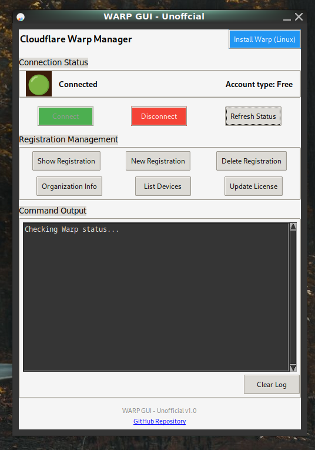

# 🚀 Warp UI (Unofficial)

A simple GUI wrapper for the official [Cloudflare Warp CLI](https://pkg.cloudflareclient.com/) built with Python and Tkinter. This tool allows users to connect, disconnect, check status, and show registration info using an easy-to-use interface.

---

## 📦 Features

- One-click **Connect / Disconnect**
- See **current connection status**
- View **registration info**
- Lightweight and beginner-friendly
- `.deb` packaging support

---

## 🔧 Requirements

- **Cloudflare WARP CLI**
  ```bash
  sudo apt install cloudflare-warp
  sudo warp-cli register
  ```


